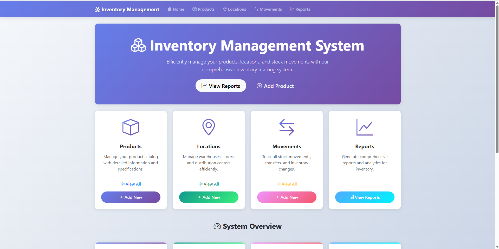
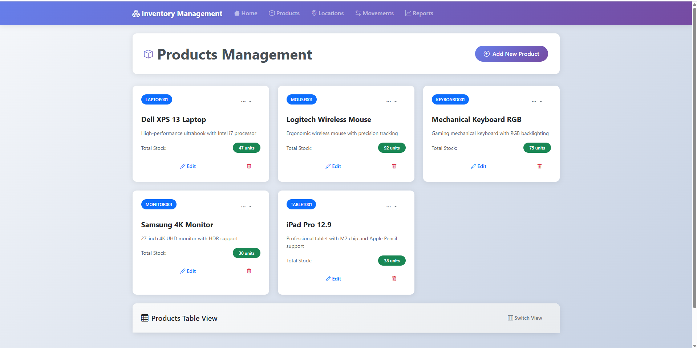
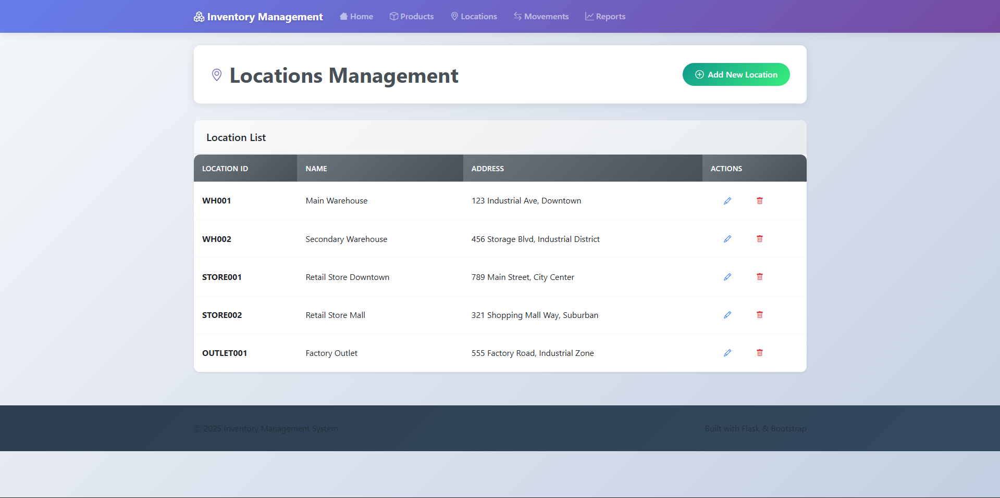
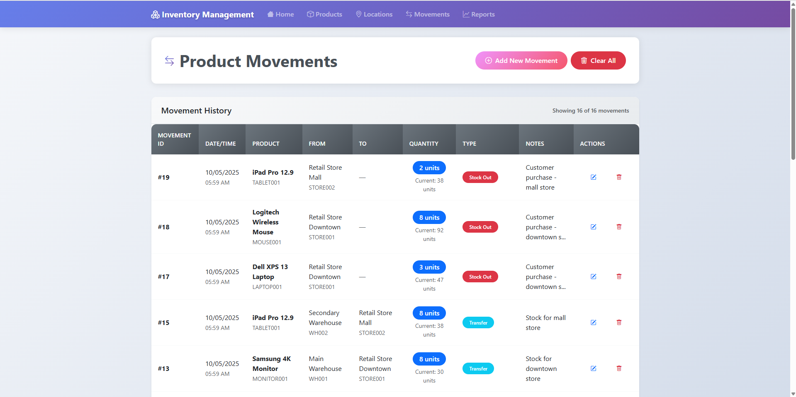
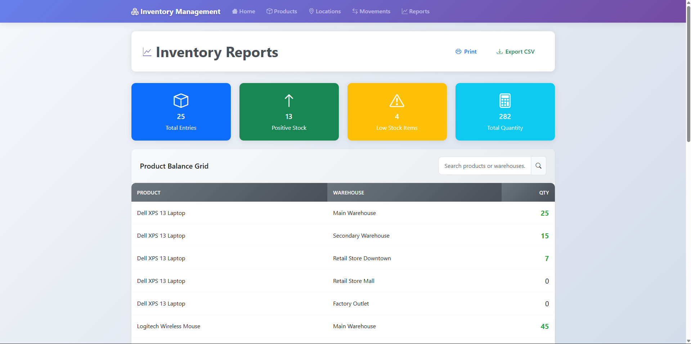

# Inventory Management System

A comprehensive Flask-based inventory management system for tracking products, locations, and stock movements with real-time reporting capabilities.

## 🚀 Features

### Core Functionality
- **Product Management**: Create, edit, and delete products with unique IDs and descriptions
- **Location Management**: Manage storage locations and warehouses
- **Movement Tracking**: Track inventory movements between locations with detailed history
- **Real-time Inventory**: Automatic calculation of stock levels across all locations
- **Comprehensive Reports**: Visual reports with charts showing inventory distribution

### Key Capabilities
- ✅ **Real-time Stock Calculation**: Automatic calculation of product balances at each location
- ✅ **Movement History**: Complete audit trail of all inventory movements
- ✅ **Multi-location Support**: Manage inventory across multiple warehouses/locations
- ✅ **Data Validation**: Prevents negative stock and invalid movements
- ✅ **Responsive Design**: Works on desktop and mobile devices
- ✅ **Interactive Charts**: Visual representation of inventory data using Chart.js

## 🛠️ Technology Stack

- **Backend**: Flask (Python)
- **Database**: SQLite with SQLAlchemy ORM
- **Frontend**: HTML5, CSS3, Bootstrap 5
- **Charts**: Chart.js for data visualization
- **Icons**: Bootstrap Icons

## 📋 Prerequisites

- Python 3.8 or higher
- pip (Python package installer)

## 🚀 Installation & Setup

1. **Clone the repository**
   ```bash
   git clone https://github.com/yourusername/inventory-management-system.git
   cd inventory-management-system
   ```

2. **Create a virtual environment** (recommended)
   ```bash
   python -m venv venv
   
   # On Windows
   venv\\Scripts\\activate
   
   # On macOS/Linux
   source venv/bin/activate
   ```

3. **Install dependencies**
   ```bash
   pip install -r requirements.txt
   ```

4. **Run the application**
   ```bash
   python app.py
   ```

5. **Access the application**
   Open your web browser and navigate to `http://localhost:5000`

## 📱 Application Screens

> **Note**: Screenshots are included below to showcase the application interface. All screenshots are stored in the `/screenshots` folder.

### Dashboard
The main dashboard provides an overview of your inventory system with key statistics:
- Total number of products
- Number of storage locations
- Total inventory movements
- Count of items currently in stock



### Products Management
- **Add Products**: Create new products with unique IDs, names, and descriptions
- **Edit Products**: Modify existing product information
- **Delete Products**: Remove products (with safety checks for existing movements)
- **View All Products**: List all products with current stock levels



### Locations Management
- **Add Locations**: Create new storage locations and warehouses
- **Edit Locations**: Modify location details
- **Delete Locations**: Remove locations (with safety checks)
- **View All Locations**: List all storage locations



### Movements Management
- **Add Movements**: Record inventory movements between locations
- **Edit Movements**: Modify existing movement records
- **Delete Movements**: Remove movement records
- **Movement History**: Complete audit trail of all inventory transactions
- **Clear All Movements**: Bulk delete option with confirmation



### Reports
- **Inventory Distribution**: Visual charts showing product distribution across locations
- **Stock Levels**: Current stock levels for all products
- **Location Summary**: Inventory summary by location



## 🗄️ Database Schema

### Products Table
- `product_id` (Primary Key): Unique product identifier
- `name`: Product name
- `description`: Product description
- `total_qty`: Total quantity across all locations

### Locations Table
- `location_id` (Primary Key): Unique location identifier
- `name`: Location name
- `description`: Location description

### Product Movements Table
- `movement_id` (Primary Key): Auto-increment ID
- `product_id`: Foreign key to Products
- `from_location`: Source location (nullable for incoming stock)
- `to_location`: Destination location (nullable for outgoing stock)
- `qty`: Movement quantity
- `timestamp`: Movement date and time
- `notes`: Optional movement notes


